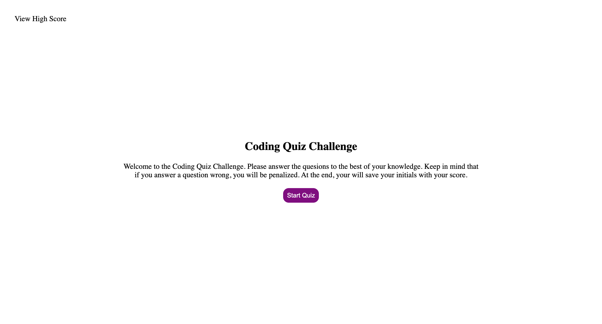
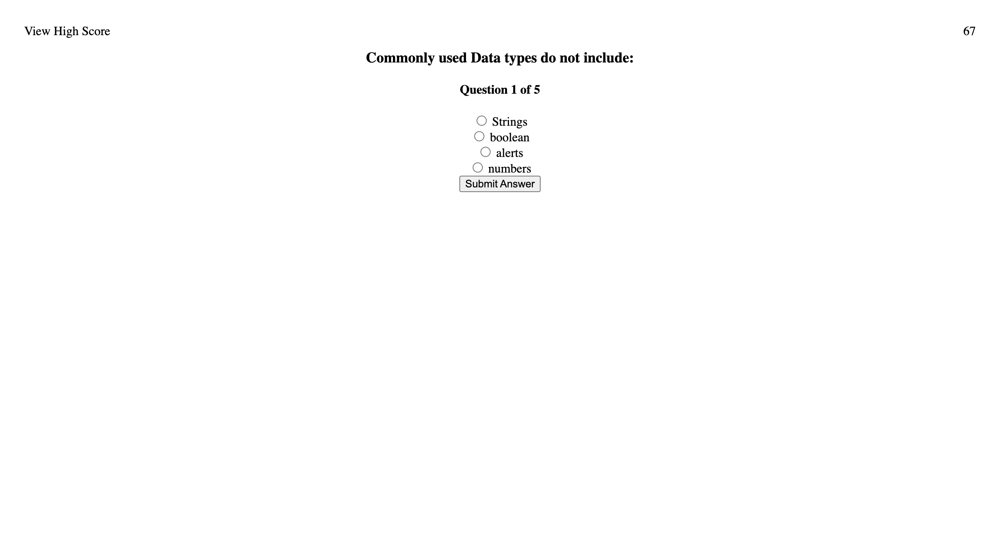
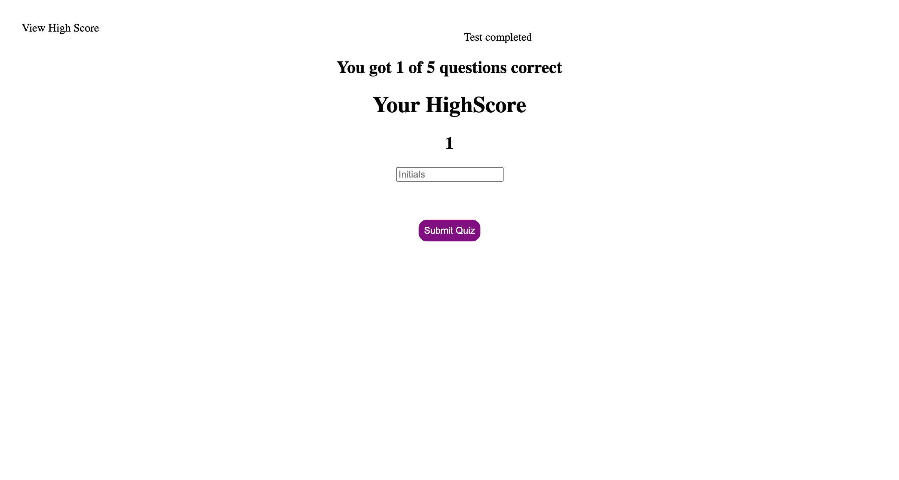

# Code Quiz (JavaScript)

This application is timed javascript quiz! Built with HTML, CSS, and JS, a user has 75 seconds to answer all questions. If the user incorrectly answers a question, time will be deducted from the clock. At the end, the user will be able to input their score to a highscore scoreboard.


## Acceptance Criteria

```
* Use of a start button
* A time that starts when a question is presented
* Questions rotate one after another once a response is validated
* Incorrect responses will be penalized
* The game ends when ALL questions are answered or the clock reaches 0
* The user can save their score
```

### Deployed URL


### Preview

#### Code Quiz Landing



#### Code Quiz Questions



#### Code Quiz Scores

